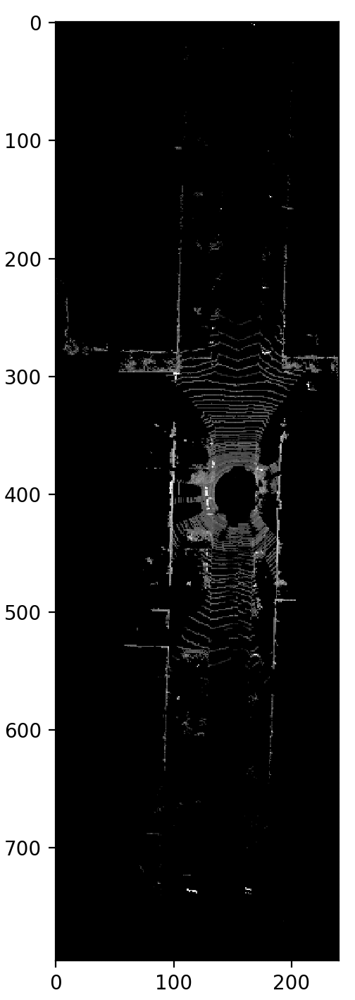
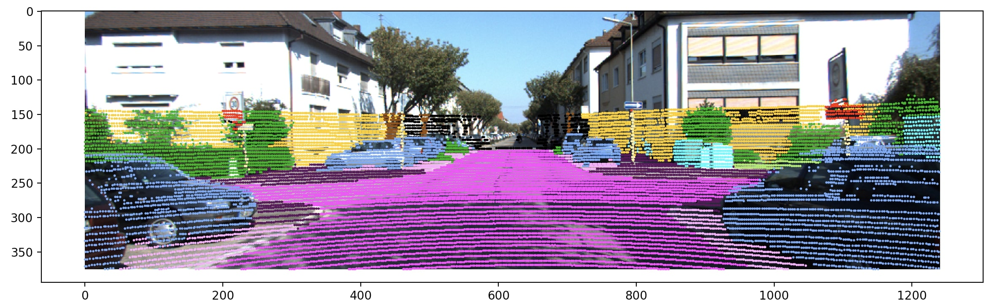
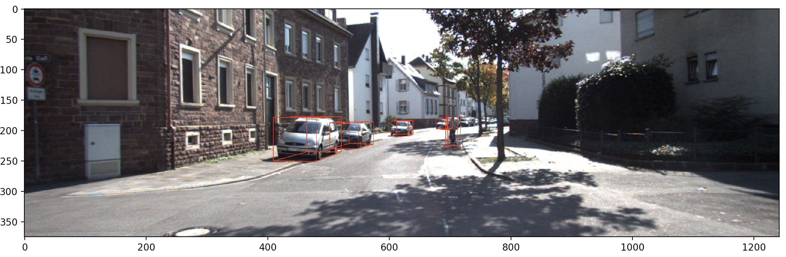
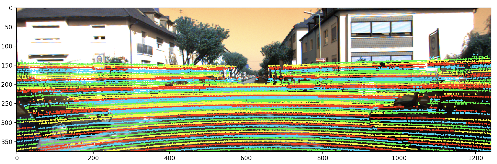
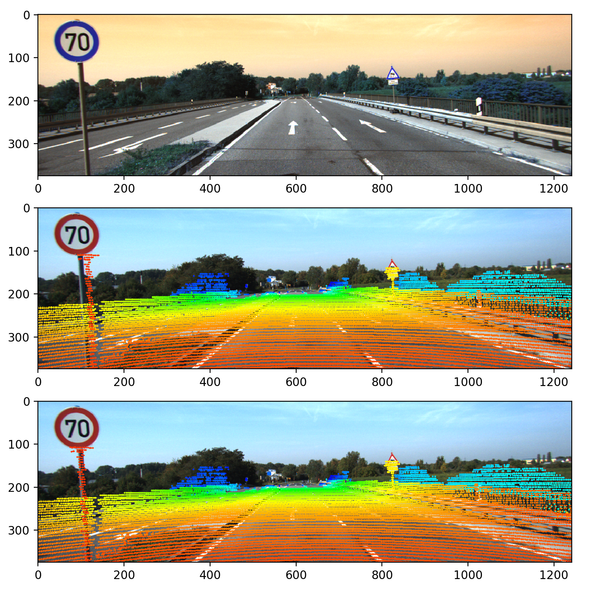

# Deep Learning for Autonomous Driving Project 2

## Directory/File Structure:
    .
    ├── data
    |   └── detection_data.p            #Used for Problem 1-3
    |   └── segmentation_data.p         #Used for Problem 1-3
    ├── report
    │   └── images                      #Final result images
    │   └── dl4ad_project1_v1.pdf       #Detailed explanation of the solution
    ├── data_utils.py                   #helper function
    ├── prob1.py                        #Solution to problem 1
    ├── prob2a.py                       #Solution to problem 2a
    ├── prob2b.py                       #Solution to problem 2a
    ├── prob3.py                        #Solution to problem 3
    ├── prob4.py                        #Solution to problem 4

## Probelm 1: Bird’s Eye View

Display the BEV image of the given scene in segmentation data.p with pixel intensities corresponding to the points’ respective reflectance values.
Run the following command

```bash
python prob1.py
```

### Reulting Image



## Probelm 2: Projection onto Image Plane

2a.Project the point cloud of segmentation data.p onto the image of Cam 2. Color each point projected according to their respective label.
2b.Project the 3d bounding boxes of all given vehicles, cyclists and pedestrians within the scene of detection data.p to the Cam 2 image.

```bash
python prob2a.py
python prob2b.py
```

### Resulting Image



## Probelm 3: ID Laser ID

3.Identify the Laser IDs i ∈ {1, ..., 64} for every point in the point cloud in segmentation data.p and project them to Cam2. You can use four alternating colors to indicate the identified IDs

```bash
python prob3.py
```

### Resulting Image



## Probelm 4: Remove Motion Distortion

4.LiDAR scanner takes depth measurements continuously while rotating around its vertical axis (in contrast to the cameras, which are triggered at a certain point in time). Acquiring data from a moving car means that the car moves fast while the LiDAR rotates.Remove the motion distortion caused the movin car.

```bash
python prob4.py
```

### Resulting Image

